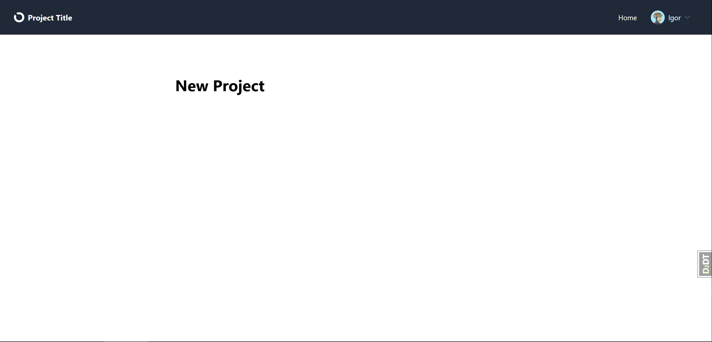
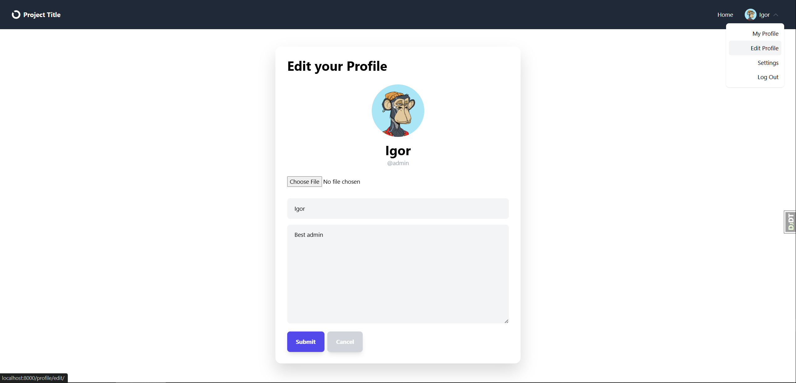
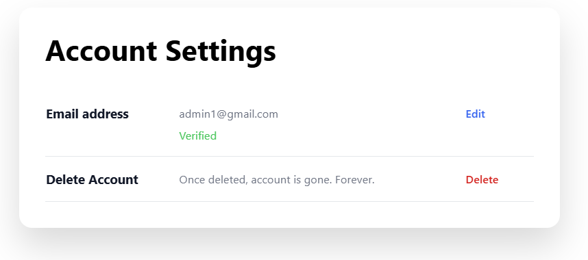
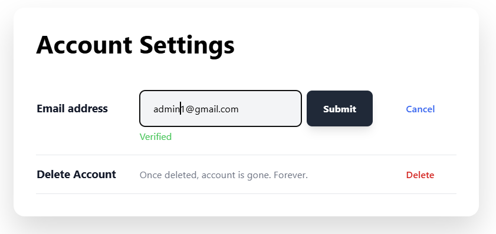
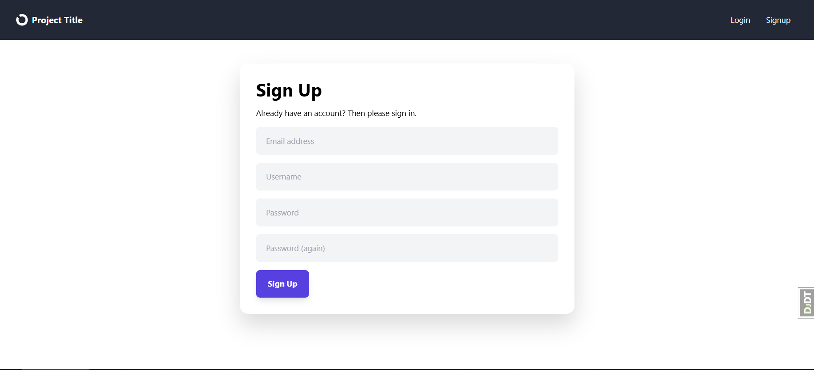

# Enerdjized 
[](https://www.python.org/downloads/)
[](https://www.djangoproject.com/)

> A batteries-included Django starter project for rapid development with modern tools

## Overview

Enerdjized is a powerful Django starter kit that combines the best modern tools and practices for web development. Built with HTMX, AlpineJS, and Tailwind CSS, it provides everything you need to start building professional web applications.

## Screenshots

<table>
  <tr>
    <td align="center">
      <a href="assets/1.png" target="_blank" title="Main Page">
        
      </a>
      <br />
      <em>Main Page</em>
    </td>
    <td  align ="center">
      <a href="assets/2.png" target="_blank" title="Edit Profile">
        
      </a>
      <br />
      <em>Edit Profile</em>
    </td>
    <td align="center">
    <a href="assets/3.png" target="_blank" title="Account Settings">
      
    </a>
      <br />
      <em>Account Settings</em>
    </td>
  </tr>
  <tr>
    <td align="center">
    <a href="assets/3.5.png" target="_blank" title="Inline Form">
        
      </a>
      <br />
      <em>Inline Form</em>
    </td>
    <td align="center">
      <a href="assets/4.png" target="_blank" title="Beautiful Signup">
        
      </a>
      <br />
      <em>Beautiful Signup</em>
    </td>
  </tr>
</table>

## Features

### Frontend
- Tailwind CSS for modern, responsive styling
- HTMX for dynamic interactions
- AlpineJS for reactive components
- Beautiful toast messages with auto-dismissal
- Responsive design out of the box

### Backend
- Separate settings for local and production environments
- Custom User model
- Profile management system
- Django Debug Toolbar integration
- Basic test suite

### Authentication
- Complete user authentication flow with django-allauth
- Email verification system
- Account management (edit, delete)
- Profile settings with HTMX integration

### Development Tools
- Django Debug Toolbar
- Widget Tweaks for form styling
- HTMX integration

## Prerequisites

- Python 3.8 or higher
- pip (Python package manager)
- Git
- Basic knowledge of Django

## Quick Start

```bash
# Create virtual environment
python -m venv venv

# Activate virtual environment
# Windows
venv\Scripts\activate
# macOS/Linux
source venv/bin/activate

# Clone repository
git clone git@github.com:igorsimb/django-project-template.git .

# Install dependencies
pip install -r requirements.txt

# Setup database
python manage.py migrate

# Run tests
python manage.py test

# Run server
python manage.py runserver
```

## Usage Note

When working with the User model, always use:

```python
from django.contrib.auth import get_user_model
User = get_user_model()
```

## Troubleshooting

### Common Issues

1. **Installation Errors**
   - Ensure you're using Python 3.8+
   - Verify your virtual environment is activated
   - Try updating pip: `python -m pip install --upgrade pip`

2. **Database Migrations**
   - If you encounter migration errors, try:
     ```bash
     python manage.py migrate --run-syncdb
     ```

3. **Static Files Not Loading**
   - Run `python manage.py collectstatic`
   - Verify your `STATIC_ROOT` setting

## Contributing

Contributions are welcome! Please feel free to submit a Pull Request.
